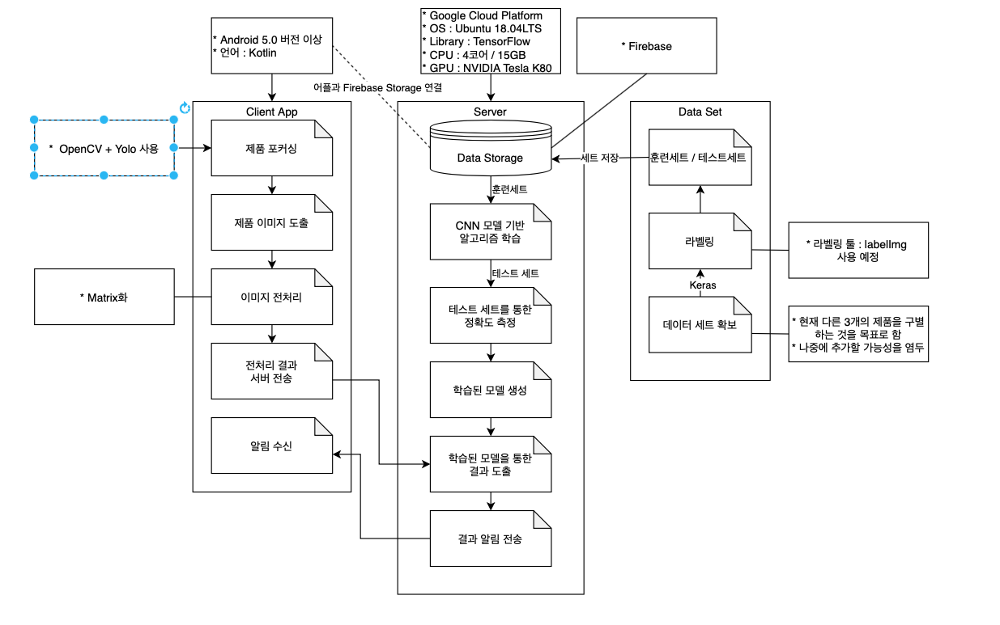

<br>
<h1 align="center"> KPU 2021 컴퓨터 공학과 졸업 작품 </h1>
<h2 align="center"> 시각장애인을 위한 편의점 제품 인식 어플리케이션 🏪  </h2>
<br>

---
## ⭐️ **팀원 역할 및 소개** ⭐️
<table>
  <tr>
    <td align="center"><a href="https://github.com/contea95"><br /><sub><b>한상혁</b></sub></a><br />서버/머신러닝</td>
    <td align="center"><a href="https://github.com/dasoopark"><br /><sub><b>박다수</b></sub></a><br />어플리케이션</td>
    <td align="center"><a href="https://github.com/1007ChaeMin"><br /><sub><b>임채민</b></sub></a><br />안드로이드/머신러닝</td>
    <td align="center"><a href="https://github.com/Jiwoon22"><br /><sub><b>정지운</b></sub></a><br />데이터셋</td>
  </tr>
</table>

---
## 개발 방법
### **Agile Framework - Scrum 모델** 사용

#### 사용 협업 툴

1. [Github](https://github.com/kpuce2021/Dandelion)
2. [Trello](https://trello.com/b/BMWAK0oT)
3. [SpreadSheet](https://docs.google.com/spreadsheets/d/1auyVjzKxb7iPgwjhEjFhaKm2PBqUoI8BcHxVw9EPz6k/edit?usp=sharing)
4. Slack

---
## 시스템 설계


---
## 서비스 WorkFlow
- 이미지 추가 예정


---
## Foldering
```

```
---
## 기능 개발 여부 / 담당자
| 기능  | 상세 기능 | 담당자 | 구현 여부 |
| :---: | :-------- | :----- | :-------: |

---

## 개발 환경 및 사용 라이브러리
| 라이브러리 | 목적 |      |
| :--------: | :--- | :--- |
|Retrofit2|HTTP 통신|
|            |      |      |


---
